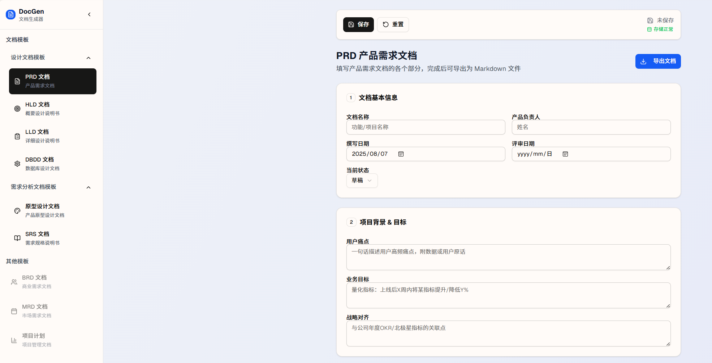

# DocGen 文档生成器

一个现代化的产品需求文档生成工具，帮助产品经理和开发团队快速创建专业的项目文档




## 🚀 功能特性

### 📋 支持的文档类型

- **PRD 产品需求文档** - 完整的产品需求文档模板
- **HLD 概要设计说明书** - 系统概要设计文档
- **LLD 详细设计说明书** - 系统详细设计文档
- **DBDD 数据库设计文档** - 数据库设计规范文档
- **SRS 需求规格说明书** - 软件需求规格说明书
- **产品原型设计文档** - 产品原型和交互设计文档

### 🔄 即将推出

- **BRD 商业需求文档** - 商业需求分析文档
- **MRD 市场需求文档** - 市场需求分析文档
- **项目计划文档** - 项目管理计划模板

### ✨ 核心功能

- **智能表单** - 结构化的文档编辑界面
- **实时保存** - 自动保存用户输入内容
- **数据持久化** - 使用 Redux + localStorage 保存数据
- **Markdown 导出** - 一键导出为 Markdown 格式
- **响应式设计** - 支持桌面和移动设备
- **主题切换** - 支持明暗主题切换
- **重置功能** - 一键清除所有数据

## 🛠️ 技术栈

- **前端框架**: Next.js 15.2.4 + React 19
- **样式框架**: Tailwind CSS 4.1.9
- **UI 组件**: Radix UI + shadcn/ui
- **状态管理**: Redux Toolkit + Redux Persist
- **表单处理**: React Hook Form + Zod
- **类型安全**: TypeScript 5
- **包管理**: pnpm

## 📦 安装和运行

### 环境要求

- Node.js 18+ 
- pnpm (推荐) 或 npm

### 安装依赖

```bash
# 使用 pnpm (推荐)
pnpm install

# 或使用 npm
npm install
```

### 开发模式

```bash
# 启动开发服务器
pnpm dev

# 或
npm run dev
```

访问 [http://localhost:3000](http://localhost:3000) 查看应用。

### 生产构建

```bash
# 构建生产版本
pnpm build

# 启动生产服务器
pnpm start
```

## 🎯 使用指南

### 1. 选择文档模板

在左侧边栏选择需要创建的文档类型：
- PRD - 产品需求文档
- HLD - 概要设计说明书
- LLD - 详细设计说明书
- DBDD - 数据库设计文档
- SRS - 需求规格说明书
- 产品原型设计文档

### 2. 填写文档内容

根据模板提示填写相应的内容：
- 文档基本信息（名称、作者、日期等）
- 项目背景和目标
- 功能需求和非功能需求
- 用户故事和验收标准
- 风险评估和里程碑计划

### 3. 保存和导出

- **自动保存**: 内容会自动保存到浏览器本地存储
- **手动保存**: 点击"保存"按钮手动保存当前文档
- **导出文档**: 点击"导出"按钮将文档导出为 Markdown 格式

### 4. 数据管理

- **重置功能**: 在侧边栏底部可以一键清除所有保存的数据
- **数据恢复**: 重新打开应用时会自动恢复之前保存的数据

## 📁 项目结构

```
prd-generator/
├── app/                    # Next.js 应用页面
│   ├── page.tsx           # 主页面
│   └── test-reset/        # 测试页面
├── components/             # React 组件
│   ├── ui/                # 基础 UI 组件
│   ├── prd-generator.tsx  # PRD 生成器
│   ├── hld-generator.tsx  # HLD 生成器
│   ├── lld-generator.tsx  # LLD 生成器
│   ├── dbdd-generator.tsx # DBDD 生成器
│   ├── srs-generator.tsx  # SRS 生成器
│   ├── prototype-generator.tsx # 原型生成器
│   ├── sidebar.tsx        # 侧边栏组件
│   └── action-buttons.tsx # 操作按钮组件
├── store/                 # Redux 状态管理
│   ├── index.ts           # Store 配置
│   └── documentSlice.ts   # 文档状态切片
├── hooks/                 # 自定义 Hooks
│   └── use-document-storage.ts # 文档存储 Hook
├── lib/                   # 工具库
│   └── utils.ts           # 工具函数
└── styles/                # 样式文件
    └── globals.css        # 全局样式
```

## 🔧 开发指南

### 添加新的文档模板

1. 在 `components/` 目录下创建新的生成器组件
2. 在 `app/page.tsx` 中注册新模板
3. 在 `components/sidebar.tsx` 中添加导航项

### 自定义样式

项目使用 Tailwind CSS，可以通过修改以下文件自定义样式：
- `styles/globals.css` - 全局样式
- `components/ui/` - UI 组件样式

### 状态管理

使用 Redux Toolkit 管理应用状态：
- `store/documentSlice.ts` - 文档相关状态
- `store/index.ts` - Store 配置


## 📝 脚本命令

```bash
# 开发
pnpm dev          # 启动开发服务器
pnpm build        # 构建生产版本
pnpm start        # 启动生产服务器
pnpm lint         # 代码检查
```

## 🤝 贡献指南

1. Fork 项目
2. 创建功能分支 (`git checkout -b feature/AmazingFeature`)
3. 提交更改 (`git commit -m 'Add some AmazingFeature'`)
4. 推送到分支 (`git push origin feature/AmazingFeature`)
5. 打开 Pull Request

## 📄 许可证

本项目采用 MIT 许可证 - 查看 [LICENSE](LICENSE) 文件了解详情。

## 🙏 致谢

- [Next.js](https://nextjs.org/) - React 框架
- [Tailwind CSS](https://tailwindcss.com/) - CSS 框架
- [Radix UI](https://www.radix-ui.com/) - 无障碍 UI 组件
- [shadcn/ui](https://ui.shadcn.com/) - UI 组件库
- [Redux Toolkit](https://redux-toolkit.js.org/) - 状态管理
- [React Hook Form](https://react-hook-form.com/) - 表单处理

---

